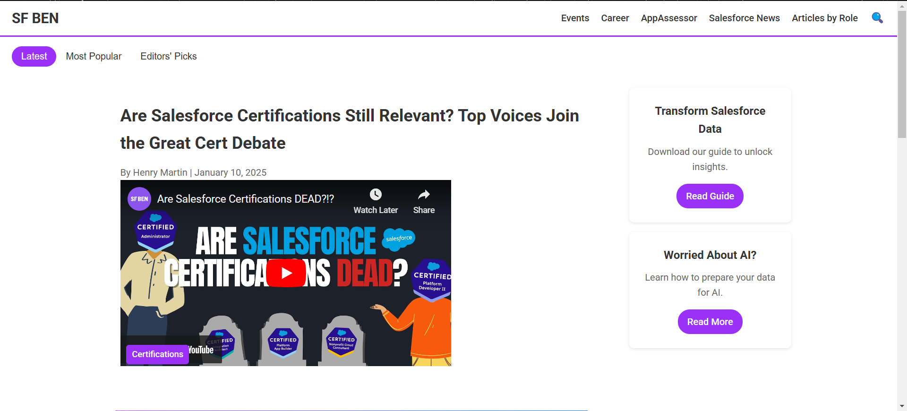
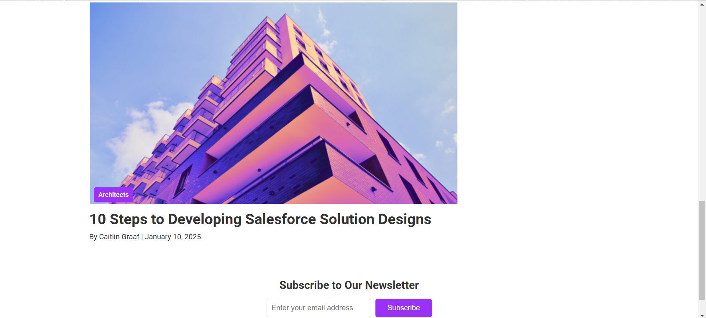

# SalesforceBen UI

This is a FullStack project that replicates a SalesforceBen-inspired UI. It includes a front-end built with HTML, CSS, and JavaScript, and a back-end implemented with PHP and PHPMailer for handling email subscriptions.

---

## Features

### Front-End:
- **Responsive Design**: Ensures the layout adapts to different screen sizes.
- **Tabbed Navigation**: Switch between "Latest", "Most Popular", and "Editors' Picks" content sections.
- **Embedded Media**: YouTube video player integrated within the content.
- **Dynamic UI Components**: Search icon, subscription forms, and content badges.
- **Styling**: Styled using CSS, with Roboto font and hover effects for better interactivity.

### Back-End:
- **Subscription Form**: Captures user email and sends a confirmation email.
- **Email Integration**: Uses PHPMailer for sending emails via Gmail's SMTP.
- **Validation**: Ensures user inputs are sanitized and validated.

---

## File Structure

```
project-folder/
│
├── index.html # Main HTML file
├── style.css # Styling for the UI
├── script.js # JavaScript for interactive elements
├── subscribe.php # PHP file to handle form submissions
├── vendor/ # PHPMailer dependencies
│ ├── autoload.php # PHPMailer autoloader
│ └── phpmailer/ # PHPMailer core library
├── images/ # Contains images used in the project
│ ├── AI-img.png
│ └── Architect-img.png
└── README.md # Project documentation
```

---

## Screenshots



